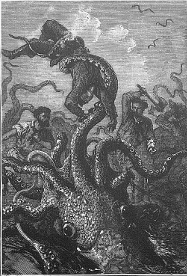
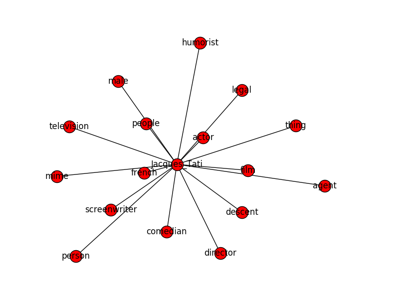

# KRAKEN
#### *un moteur de similarité sémantique*

---
#### Comment découvrir des connaissances sans connaître le vocabulaire ?
#### Comment faire de l'alignement automatique entre triplestore ?
---

**Ceci est un projet exploratoire**

Explorer un triple-store par analogie sans connaissance préalable du vocabulaire:
1. A partir des prédicats de *n* ressources
2. Détecter les similarités de description
3. Permettre l'alignement entre triplestore: enrichir les relations
4. Permettre l'inférence: des points communs intéressants

---
#### Hypothèse de départ

Une ressource est définie sémantiquement par des prédicats normés et classés dans des vocabulaires spécifiques. Les relations qu'elle entretient avec d'autres ressources sont définies par une ontologie, et son modèle.

---

Un objet du monde est donc représenté par un graphe étiqueté.
Le modèle BNF

---
Décrire un ressource a partir de ses prédicats

