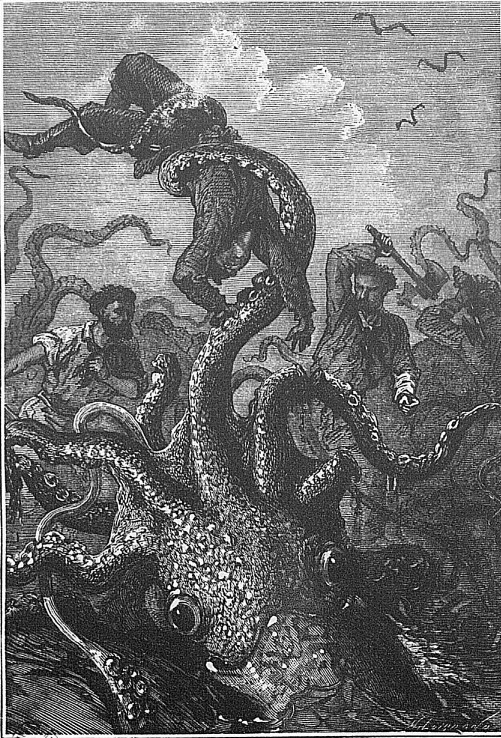
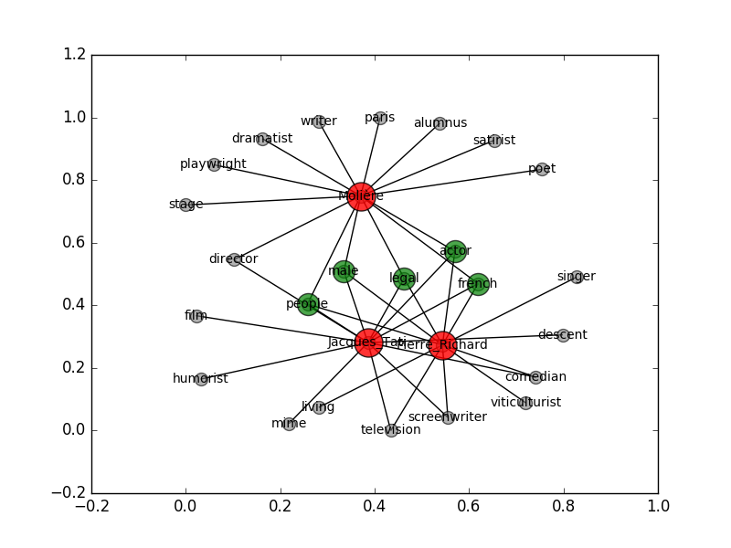

# Kraken
[](https://gitpitch.com/c24b/kraken_data/master?grs=github&t=moon)

Projet exploratoire lié à un constat personnel autour du web sémantique: la difficulté de requêter les ressources du web sémantique sans connaitre les caractéristique de cette ressource. Les prédicats varient en fonction de la ressource et du triplestore. Un frein à l'utilisation de tous le potentiel du Linked Open Data notamment pour la découverte de connaissance.

Contrairement aux modèles d'exploration de données issues du Big Data, ou l' on déduit le modèle de corrélations statistiques observés ou de score de pertinence, les données du web sémantiques sont fortement caractérisées à l'aide d'une norme et d'un vocabulaire controlée. Sa force (pour son expressivité et sa précision) constitue à la fois sa faiblesse puisque que le cout d'entrée est lourd et le parcours du graphe à l'aveugle est lourd, il tient  à la connaissance qu'un humain à du modèle et sa compréhension et identification du sens qu'entretiennent les différentes ressources entre elles.

Le projet exploration consiste à appliquer les méthodes statistiques de vecteur pour parcourir un graphe et utiliser les potentialitées des graphes etiquetés sans connaissance préalable du modèle.

Goal: Explore links shared between different ressources
and discover their hidden relationship.

Provide a method to query the semantic graph WITHOUT knowing the model:
1. How to describe the ressource?
2.  and the relationship between the ressource step by step.


# KRAKEN



---------

Projet exploratoire: Explorer un triple-store par analogie sans connaissance préalable du vocabulaire:
1. A partir des prédicats de *n* ressources
4. Détecter les similarités de description
5. et permettre l'inférence et l'alignement

---------------

## Hypothèses de travail

Les ressources sont reparties dans différents triplestores elles possèdent différentes caractéristiques parfois redondantes parfois semblables dans leur énoncés.

--------------
Décrire les liens qu'entretiennent deux ou + de ressources
à plusieurs niveaux et en déduire leurs caractéristiques majeures.
-------------------
La similarité entre n ressources est définie par
le nombre de prédicats commun
pondérées par le nombre de prédicats qui la définissent
--------------------
Cette mesure de similarité est ensuite affinée par le nombre d'étapes (de pas) dans le parcours du graph
qui s'arrête au moment ou deux objets sont communs ou lorsque la source est identique à l'objet.
---
* Premiers développements
* Outils de visualisations

---

## Premiers dévelopements

Objectif: Cartographier les points communs entre n ressources et parcourir les liens(étiquettes) qu'ils ont en commun

### Décrire une ressource a partir de ces prédicats

En prenant une ressource disponible dans un triplestore
(pour le moment wikidata)
on constitue une typologie (un dictionnaire de types) pour cette ressource à partir des prédicats qui décrivent la ressource comme composé dans le fichier [`types.json`](./types.json).
```json
{
    "20th-centuryActors": {
        "_score": 1,
        "ns": [
            "http://dbpedia.org/class/yago"
        ],
        "resources": [
            "Jean_Dujardin"
        ],
        "urls": [
            "http://dbpedia.org/class/yago/Wikicat20th-centuryActors"
        ]
    },
    "20th-centuryFrenchMaleActors": {
        "_score": 1,
        "ns": [
            "http://dbpedia.org/class/yago"
        ],
        "resources": [
            "Jean_Dujardin"
        ],
        "urls": [
            "http://dbpedia.org/class/yago/Wikicat20th-centuryFrenchMaleActors"
        ]
    },
    "21st-centuryActors": {
        "_score": 1,
        "ns": [
            "http://dbpedia.org/class/yago"
        ],
        "resources": [
            "Jean_Dujardin"
        ],
        "urls": [
            "http://dbpedia.org/class/yago/Wikicat21st-centuryActors"
        ]
    }
  }
```


* Niveau 0:
Les ressources partagent x prédicats


* Niveau 1:
Les ressources partagent des **étiquettes** de prédicats en commun

* Niveau 2 etc...
